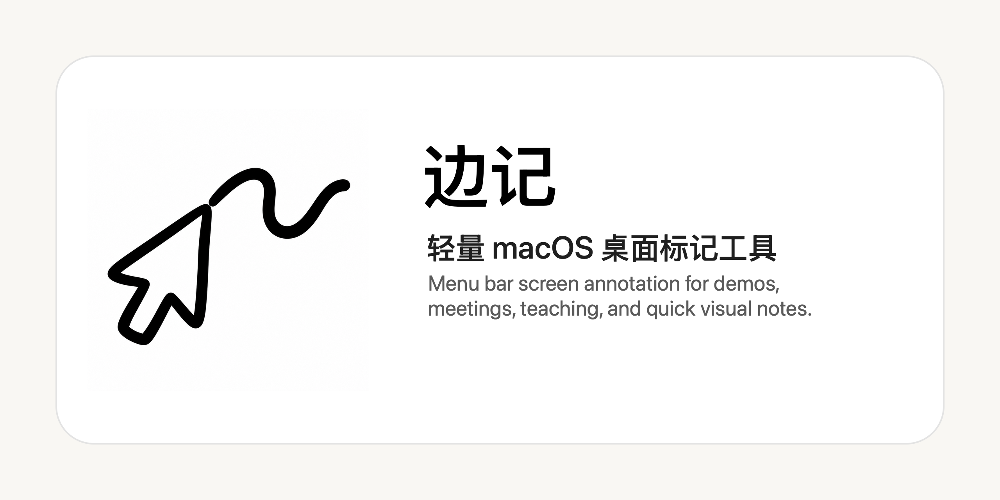

# 边记



边记是一款轻量 macOS 桌面标记工具。它适合在演示、录屏、远程会议、教学和临时讲解时，直接在屏幕上画重点。

当前版本重点不是做复杂白板，而是把最常用的“边看边标记”做得足够轻、足够快、足够稳定。

## 功能

- 直接在桌面上标记，不需要截图后再编辑。
- 通过 macOS 顶部菜单栏控制，不占用屏幕中央空间。
- 支持 `画笔`、`直线`、`箭头`、`矩形`、`圆形`。
- 支持预设颜色和系统色盘。
- 支持 4 档线条粗细。
- 标记状态下显示小笔光标，画线位置跟随笔尖。
- 支持撤回、清空、右键清空。
- 暂停标记后，鼠标点击会穿透回原来的桌面和应用。
- 不使用低层全局鼠标事件钩子，优先保证系统稳定。

## 快捷键

| 快捷键 | 功能 |
| --- | --- |
| `1` | 画笔 |
| `2` | 直线 |
| `3` | 箭头 |
| `4` | 矩形 |
| `5` | 圆形 |
| `[` | 线条变细 |
| `]` | 线条变粗 |
| `Cmd + Z` | 撤回 |
| `Cmd + K` | 清空 |
| `Esc` | 暂停标记 |
| 鼠标右键 | 清空当前标记 |

## 使用方式

1. 打开 `边记.app`。
2. 点击 macOS 顶部菜单栏里的光标曲线图标。
3. 选择一个工具，比如 `画笔` 或 `箭头`。
4. 在桌面上直接拖动鼠标进行标记。
5. 按 `Esc` 暂停标记，恢复普通桌面操作。

## 安装

下载 release 包后，解压 `边记.app`，拖到 `Applications` 文件夹即可。

如果 macOS 提示“无法打开，因为无法验证开发者”，这是因为当前版本还没有 Apple Developer ID 正式签名。可以在 Finder 里右键点击 `边记.app`，选择 `打开`，再确认打开。

## 从源码运行

环境要求：

- macOS 14 或更新版本
- Swift 6 或更新版本

运行：

```bash
swift run ScreenMarker
```

打包：

```bash
scripts/package-app.sh
```

生成 release zip：

```bash
scripts/make-release.sh
```

测试：

```bash
scripts/smoke-test.sh
```

## 当前版本

当前版本是 `v0.1.0`。

这是一个稳定可用的 MVP 版本，已经具备桌面标记的核心功能。后续优先考虑：

- 文字标注
- 截图导出
- 自动淡出标记
- 全局快捷键显示/隐藏
- 光标高亮和点击效果

## 技术说明

边记使用 Swift + AppKit 实现。

核心设计选择：

- 使用透明 overlay window 负责绘图。
- overlay 不覆盖 macOS 顶部菜单栏，保证菜单控制始终可点击。
- 空闲状态下 overlay 鼠标穿透，不影响正常桌面使用。
- 绘图状态下 overlay 接管鼠标，用普通 AppKit 事件完成绘制。
- 不使用全局事件监听和低层事件钩子，降低系统卡死风险。

## 资源

- App 图标源图：`assets/icon-source.png`
- macOS 图标文件：`assets/AppIcon.icns`

## License

暂未指定开源协议。
